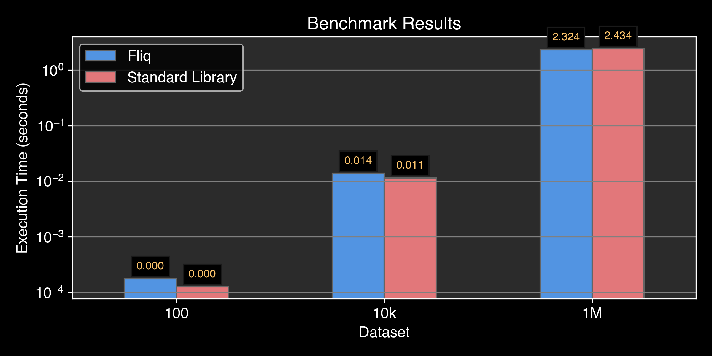

#   Fliq

Fluent-syntaxed Lazily-evaluated Integrated Query.

[//]: # (bages using https://shields.io/badges/)
[](https://github.com/oribarilan/fliq/actions/workflows/package_build.yml)
[](https://github.com/oribarilan/fliq/actions/workflows/lint.yml)
[](https://github.com/oribarilan/fliq/actions/workflows/coverage.yml)

[](https://www.python.org/downloads/)
[](https://pypi.org/project/fliq/)
[](https://pypi.org/project/fliq/)
[](https://github.com/astral-sh/ruff)

Fliq is a lightweight Python library for high-performance processing of iterables,
inspired by [Django's ORM](https://docs.djangoproject.com/en/4.2/topics/db/queries/)
and [LINQ](https://learn.microsoft.com/en-us/dotnet/standard/linq/).
It provides a fluent syntax for lazily-evaluated operations on iterables, 
and it is tested to have on-par performance with the standard library.

* Documentation: https://oribarilan.github.io/fliq
* Source Code: https://github.com/oribarilan/fliq

## Installation

```shell
pip install fliq
```

## Fliq is

- 💡 **Intuitive** to use. Built for readability and usability.
- 🪶 **Lightweight** wrapper for the standard library. No dependencies or bloat.
- ⚡️ **Efficient** as the standard library. Abstraction overhead is kept to a minimum. 
- ⏳ **Lazy** evaluated, executed only _when_ needed and only _as_ needed.
- 🔗 **Versatile** by supporting any iterable type, including infinite iterables and data streams.
- 🧩 **Compatible** with APIs consuming iterables. No integration or setup required.

## Motivation

What is the output of the following code?
```python
next(map(lambda x: x * 2, filter(lambda x: x % 2 == 0, [1, 2, 3, 4, 5])), -1)
```

And what about this?
```python
from fliq import q

(q([1, 2, 3, 4, 5])
    .where(lambda x: x % 2 == 0)
    .select(lambda x: x * 2)
    .first_or_default(default=-1))
```

And this is just a simple example.

Python's standard library provides a rich set of functions for processing iterables.
However, it is not always easy to read and use. 

This is especially true when chaining multiple operations together.
This is where Fliq comes in.
Fliq provides a fluent, easy to read syntax for processing iterables, while keeping
performance on-par with the standard library.

## Efficiency

### Memory
Fliq is lazy. It does not materialize the iterable, unless the operation requires it (e.g., reverse).
This allows Fliq to make minimal use of memory.

Abstracting the (lazy) evaluation, reduces cognitive load from the user, 
thus implicitly opting in for a more efficient computation,
which in turn improves efficiency compared to eager list processing code.

### Performance
Fliq is designed to be a lightweight wrapper for the standard library.
It keeps abstraction overhead to a minimum, 
and it is tested to have on-par performance with the standard library.

There are two mechanisms for checking Fliq's performance: Performance tests and benchmarking.

#### Performance Tests
These tests are ran on every commit, and they compare Fliq's performance to the standard library.
They allow performance difference to be `1%` or smaller, and they are ran on every Python version, 3.9 and above.

You can find the performance tests in 
[Performance tests](https://github.com/oribarilan/fliq/blob/main/fliq/tests/system/test_performance.py).

#### Benchmarking
Fliq is being benchmarked against the standard library. The list of 
benchmarked scenarios expands over time. 

Currently, there are 2 scenarios tested with varying dataset sizes (100, 10K, 1M).

* Scenario 1: zipping two iterables of Person objects, 
and taking the first 5 (by age asc) that are of different gender.
```python
q(dataset).zip(shuffled).where(lambda ps: ps[0].gender != ps[1].gender).order(by=lambda ps: ps[0].age+ps[1].age).take(5).to_list()
```
* Scenario 2: filtering prepending and appending a list of Person objects 
```python
q(dataset).where(lambda p: 0 <= p.age < 100).prepend_many(first).append_many(last).select(lambda p: p.name).to_list()
```

In both scenarios, Fliq is on-par with the standard library:




You can find the full benchmarking code at [Benchmark](https://github.com/oribarilan/fliq/blob/main/benchmark/benchmark.py). 

