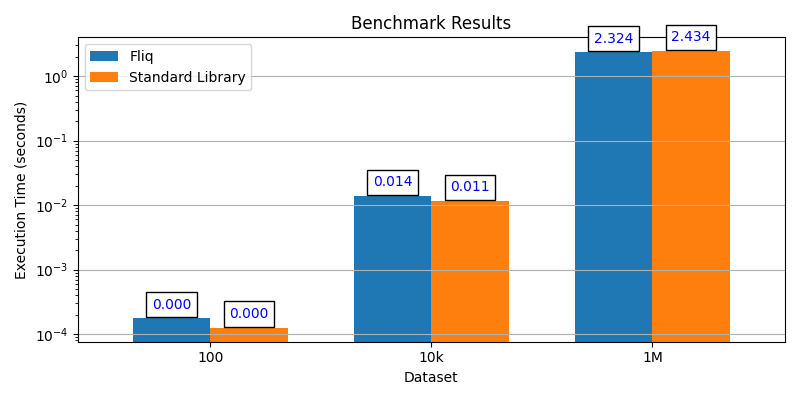

#   Fliq

Fluent-syntaxed Lazily-evaluated Integrated Query.

[//]: # (bages using https://shields.io/badges/)
[](https://github.com/oribarilan/fliq/actions/workflows/package_build.yml)
[](https://github.com/oribarilan/fliq/actions/workflows/lint.yml)
[](https://github.com/oribarilan/fliq/actions/workflows/coverage.yml)

[](https://www.python.org/downloads/)
[](https://pypi.org/project/fliq/)
[](https://pypi.org/project/fliq/)
[](https://github.com/astral-sh/ruff)

Fliq is a lightweight Python library for high-performance lazy processing of iterables.
Inspired by [Django's ORM](https://docs.djangoproject.com/en/4.2/topics/db/queries/)
and [LINQ](https://learn.microsoft.com/en-us/dotnet/standard/linq/), it provides a fluent syntax for lazily-evaluated operations on iterables, 
and it is tested to have on-par performance with the standard library.
Also, for all you type-a-holics, Fliq is fully equipped with generic type hints, so it supports mypy in strict mode.

* Documentation: [https://oribarilan.github.io/fliq](https://oribarilan.github.io/fliq)
* Source Code: [https://github.com/oribarilan/fliq](https://github.com/oribarilan/fliq)

## Installation

```shell
pip install fliq
```
* Fliq does not have any dependencies.
* Fliq supports Python 3.9 and above.

## Fliq is

- 💡 **Intuitive** to use. Built for readability and usability. Fully typed.
- 🪶 **Lightweight** wrapper for the standard library. No dependencies or bloat.
- ⚡️ **Efficient** as the standard library. Abstraction overhead is kept to a minimum. 
- ⏳ **Lazy** evaluated, executed only _when_ needed and only _as_ needed.
- 🔗 **Versatile** by supporting any iterable type, including infinite iterables.
- 🧩 **Compatible** with APIs consuming iterables. No integration or setup required.

## Motivation

What is the output of the following code?
```python
next(map(lambda x: x * 2, filter(lambda x: x % 2 == 0, [1, 2, 3, 4, 5])), -1)
```

And what about this?
```python
from fliq import q

(q([1, 2, 3, 4, 5])
    .where(lambda x: x % 2 == 0)
    .select(lambda x: x * 2)
    .first_or_default(default=-1))
```

And this is just a simple example.

Python's standard library provides a rich set of functions for processing iterables.
However, it is not always easy to read and use. 

This is especially true when chaining multiple operations together.
This is where Fliq comes in.
Fliq provides a fluent, easy to read syntax for processing iterables, while keeping
performance on-par with the standard library.

## Performance

Fliq is geared for performance:

* 🛌 It is lazily evaluated without requiring any intentional effort from the user.
* ⚡️ It is also tested to have on-par performance with the standard library.

There are two mechanisms for checking Fliq's performance: 

* 🧪 **Performance tests** are ran on every commit, and they compare Fliq's performance to the standard library.
* 📊 **Benchmarking** is done against the standard library.

Here is a glimpse of the benchmarking results:


You can read more about Fliq's performance [here](https://oribarilan.github.io/fliq/misc/performance/).


